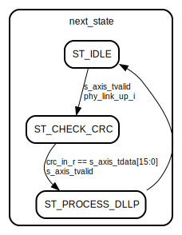

# Entity: dllp_handler 
- **File**: dllp_handler.sv
- **Title:**  dllp_handler
- **Author:**  Idris Somoye

## Diagram

## Description

Module handles datalink packets recieved from the physical layer
intended for the datalink layer. Datalink packets are decoded and replies are sent to
the physical layer through the phy master axis bus.

## Generics

| Generic name | Type | Value          | Description |
| ------------ | ---- | -------------- | ----------- |
| DATA_WIDTH   | int  | 32             |             |
| STRB_WIDTH   | int  | DATA_WIDTH / 8 |             |
| KEEP_WIDTH   | int  | STRB_WIDTH     |             |
| USER_WIDTH   | int  | 3              |             |

## Ports

| Port name           | Direction | Type             | Description |
| ------------------- | --------- | ---------------- | ----------- |
| clk_i               | input     |                  |             |
| rst_i               | input     |                  |             |
| phy_link_up_i       | input     |                  |             |
| s_axis_tdata        | input     | [DATA_WIDTH-1:0] |             |
| s_axis_tkeep        | input     | [KEEP_WIDTH-1:0] |             |
| s_axis_tvalid       | input     |                  |             |
| s_axis_tlast        | input     |                  |             |
| s_axis_tuser        | input     | [USER_WIDTH-1:0] |             |
| s_axis_tready       | output    |                  |             |
| seq_num_o           | output    | [          11:0] |             |
| seq_num_vld_o       | output    |                  |             |
| seq_num_acknack_o   | output    |                  |             |
| fc1_values_stored_o | output    |                  |             |
| fc2_values_stored_o | output    |                  |             |
| tx_fc_ph_o          | output    | [           7:0] |             |
| tx_fc_pd_o          | output    | [          11:0] |             |
| tx_fc_nph_o         | output    | [           7:0] |             |
| tx_fc_npd_o         | output    | [          11:0] |             |

## Signals

| Name                | Type                | Description |
| ------------------- | ------------------- | ----------- |
| crc_in_c            | logic        [15:0] |             |
| crc_in_r            | logic        [15:0] |             |
| crc_out             | logic        [15:0] |             |
| tlp_nullified_c     | logic               |             |
| tlp_nullified_r     | logic               |             |
| tx_tlp_ready_c      | logic               |             |
| tx_tlp_ready_r      | logic               |             |
| next_transmit_seq_c | logic        [15:0] |             |
| next_transmit_seq_r | logic        [15:0] |             |
| ackd_transmit_seq_c | logic        [11:0] |             |
| ackd_transmit_seq_r | logic        [11:0] |             |
| tx_fc_ph_c          | logic        [ 7:0] |             |
| tx_fc_ph_r          | logic        [ 7:0] |             |
| tx_fc_pd_c          | logic        [11:0] |             |
| tx_fc_pd_r          | logic        [11:0] |             |
| tx_fc_nph_c         | logic        [ 7:0] |             |
| tx_fc_nph_r         | logic        [ 7:0] |             |
| tx_fc_npd_c         | logic        [11:0] |             |
| tx_fc_npd_r         | logic        [11:0] |             |
| tx_fc_ch_c          | logic        [ 7:0] |             |
| tx_fc_ch_r          | logic        [ 7:0] |             |
| tx_fc_cd_c          | logic        [11:0] |             |
| tx_fc_cd_r          | logic        [11:0] |             |
| fc1_np_stored_c     | logic               |             |
| fc1_np_stored_r     | logic               |             |
| fc1_p_stored_c      | logic               |             |
| fc1_p_stored_r      | logic               |             |
| fc1_c_stored_c      | logic               |             |
| fc1_c_stored_r      | logic               |             |
| fc2_np_stored_c     | logic               |             |
| fc2_np_stored_r     | logic               |             |
| fc2_p_stored_c      | logic               |             |
| fc2_p_stored_r      | logic               |             |
| fc2_c_stored_c      | logic               |             |
| fc2_c_stored_r      | logic               |             |

## Processes
- main_seq: ( @(posedge clk_i or posedge rst_i) )
  - **Type:** always
- main_combo: (  )
  - **Type:** always_comb

## Instantiations

- pcie_datalink_crc_inst: pcie_datalink_crc

## State machines

