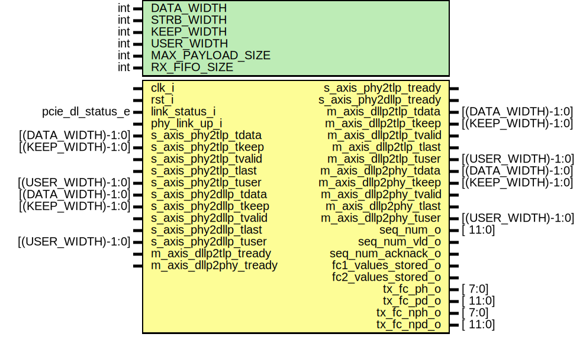

# Entity: dllp_receive 
- **File**: dllp_receive.sv
- **Title:**  dllp_receive
- **Author:**  Idris Somoye

## Diagram

## Description

Module handles datalink packets recieved from the physical layer.
It incorporates two axis slave interfaces, one indicating packets
intended for the tlp layer and the other for packets intended for the
dllp layer.

Packets intended for the tlp layer are decoded and sent through the tlp
master axis bus. Datalink packets are decoded and replies are sent to
the physical layer through the phy master axis bus.

## Generics

| Generic name     | Type | Value          | Description |
| ---------------- | ---- | -------------- | ----------- |
| DATA_WIDTH       | int  | 32             |             |
| STRB_WIDTH       | int  | DATA_WIDTH / 8 |             |
| KEEP_WIDTH       | int  | STRB_WIDTH     |             |
| USER_WIDTH       | int  | 4              |             |
| MAX_PAYLOAD_SIZE | int  | 0              |             |
| RX_FIFO_SIZE     | int  | 0              |             |

## Ports

| Port name              | Direction | Type               | Description |
| ---------------------- | --------- | ------------------ | ----------- |
| clk_i                  | input     |                    |             |
| rst_i                  | input     |                    |             |
| link_status_i          | input     | pcie_dl_status_e   |             |
| phy_link_up_i          | input     |                    |             |
| s_axis_phy2tlp_tdata   | input     | [(DATA_WIDTH)-1:0] |             |
| s_axis_phy2tlp_tkeep   | input     | [(KEEP_WIDTH)-1:0] |             |
| s_axis_phy2tlp_tvalid  | input     |                    |             |
| s_axis_phy2tlp_tlast   | input     |                    |             |
| s_axis_phy2tlp_tuser   | input     | [(USER_WIDTH)-1:0] |             |
| s_axis_phy2tlp_tready  | output    |                    |             |
| s_axis_phy2dllp_tdata  | input     | [(DATA_WIDTH)-1:0] |             |
| s_axis_phy2dllp_tkeep  | input     | [(KEEP_WIDTH)-1:0] |             |
| s_axis_phy2dllp_tvalid | input     |                    |             |
| s_axis_phy2dllp_tlast  | input     |                    |             |
| s_axis_phy2dllp_tuser  | input     | [(USER_WIDTH)-1:0] |             |
| s_axis_phy2dllp_tready | output    |                    |             |
| m_axis_dllp2tlp_tdata  | output    | [(DATA_WIDTH)-1:0] |             |
| m_axis_dllp2tlp_tkeep  | output    | [(KEEP_WIDTH)-1:0] |             |
| m_axis_dllp2tlp_tvalid | output    |                    |             |
| m_axis_dllp2tlp_tlast  | output    |                    |             |
| m_axis_dllp2tlp_tuser  | output    | [(USER_WIDTH)-1:0] |             |
| m_axis_dllp2tlp_tready | input     |                    |             |
| m_axis_dllp2phy_tdata  | output    | [(DATA_WIDTH)-1:0] |             |
| m_axis_dllp2phy_tkeep  | output    | [(KEEP_WIDTH)-1:0] |             |
| m_axis_dllp2phy_tvalid | output    |                    |             |
| m_axis_dllp2phy_tlast  | output    |                    |             |
| m_axis_dllp2phy_tuser  | output    | [(USER_WIDTH)-1:0] |             |
| m_axis_dllp2phy_tready | input     |                    |             |
| seq_num_o              | output    | [            11:0] |             |
| seq_num_vld_o          | output    |                    |             |
| seq_num_acknack_o      | output    |                    |             |
| fc1_values_stored_o    | output    |                    |             |
| fc2_values_stored_o    | output    |                    |             |
| tx_fc_ph_o             | output    | [             7:0] |             |
| tx_fc_pd_o             | output    | [            11:0] |             |
| tx_fc_nph_o            | output    | [             7:0] |             |
| tx_fc_npd_o            | output    | [            11:0] |             |

## Instantiations

- dllp_handler_inst: [dllp_handler](docs/dllp_handler.md)
- dllp2tlp_inst: [dllp2tlp](docs/dllp2tlp.md)
