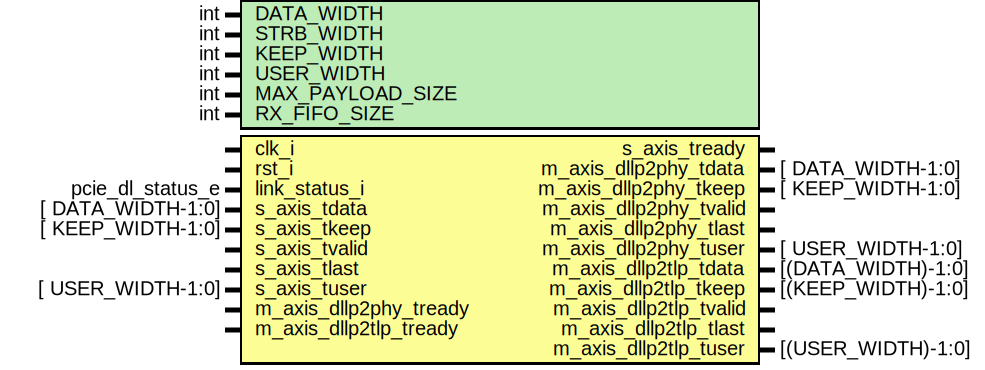
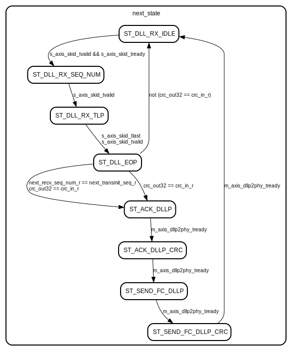

# Entity: dllp2tlp 
- **File**: dllp2tlp.sv
- **Title:**  dllp2tlp
- **Author:**  Idris Somoye

## Diagram

## Description

Module handles transaction layer packets recieved from the physical layer.
Packets intended for the tlp layer are decoded and sent through the tlp
master axis bus.

## Generics

| Generic name     | Type | Value          | Description |
| ---------------- | ---- | -------------- | ----------- |
| DATA_WIDTH       | int  | 32             |             |
| STRB_WIDTH       | int  | DATA_WIDTH / 8 |             |
| KEEP_WIDTH       | int  | STRB_WIDTH     |             |
| USER_WIDTH       | int  | 1              |             |
| MAX_PAYLOAD_SIZE | int  | 0              |             |
| RX_FIFO_SIZE     | int  | 2              |             |

## Ports

| Port name              | Direction | Type               | Description |
| ---------------------- | --------- | ------------------ | ----------- |
| clk_i                  | input     |                    |             |
| rst_i                  | input     |                    |             |
| link_status_i          | input     | pcie_dl_status_e   |             |
| s_axis_tdata           | input     | [  DATA_WIDTH-1:0] |             |
| s_axis_tkeep           | input     | [  KEEP_WIDTH-1:0] |             |
| s_axis_tvalid          | input     |                    |             |
| s_axis_tlast           | input     |                    |             |
| s_axis_tuser           | input     | [  USER_WIDTH-1:0] |             |
| s_axis_tready          | output    |                    |             |
| m_axis_dllp2phy_tdata  | output    | [  DATA_WIDTH-1:0] |             |
| m_axis_dllp2phy_tkeep  | output    | [  KEEP_WIDTH-1:0] |             |
| m_axis_dllp2phy_tvalid | output    |                    |             |
| m_axis_dllp2phy_tlast  | output    |                    |             |
| m_axis_dllp2phy_tuser  | output    | [  USER_WIDTH-1:0] |             |
| m_axis_dllp2phy_tready | input     |                    |             |
| m_axis_dllp2tlp_tdata  | output    | [(DATA_WIDTH)-1:0] |             |
| m_axis_dllp2tlp_tkeep  | output    | [(KEEP_WIDTH)-1:0] |             |
| m_axis_dllp2tlp_tvalid | output    |                    |             |
| m_axis_dllp2tlp_tlast  | output    |                    |             |
| m_axis_dllp2tlp_tuser  | output    | [(USER_WIDTH)-1:0] |             |
| m_axis_dllp2tlp_tready | input     |                    |             |

## Signals

| Name                   | Type                                    | Description |
| ---------------------- | --------------------------------------- | ----------- |
| tlp_nullified_c        | logic                                   |             |
| tlp_nullified_r        | logic                                   |             |
| tx_tlp_ready_c         | logic                                   |             |
| tx_tlp_ready_r         | logic                                   |             |
| tlp_in_c               | logic        [                    31:0] |             |
| tlp_in_r               | logic        [                    31:0] |             |
| next_transmit_seq_c    | logic        [                    15:0] |             |
| next_transmit_seq_r    | logic        [                    15:0] |             |
| next_recv_seq_num_c    | logic        [                    15:0] |             |
| next_recv_seq_num_r    | logic        [                    15:0] |             |
| tkeep_c                | logic        [                    15:0] |             |
| tkeep_r                | logic        [                    15:0] |             |
| ackd_transmit_seq_c    | logic        [                    11:0] |             |
| ackd_transmit_seq_r    | logic        [                    15:0] |             |
| fifo_tail_c            | logic        [($clog2(RX_FIFO_SIZE)):0] |             |
| fifo_tail_r            | logic        [($clog2(RX_FIFO_SIZE)):0] |             |
| fifo_head_c            | logic        [($clog2(RX_FIFO_SIZE)):0] |             |
| fifo_head_r            | logic        [($clog2(RX_FIFO_SIZE)):0] |             |
| crc_in_c               | logic        [                    31:0] |             |
| crc_in_r               | logic        [                    31:0] |             |
| crc_calc_c             | logic        [                    31:0] |             |
| crc_calc_r             | logic        [                    31:0] |             |
| crc_out16              | logic        [                    31:0] |             |
| crc_reversed           | logic        [                    31:0] |             |
| crc_out32              | logic        [                    31:0] |             |
| dllp_crc_out           | logic        [                    15:0] |             |
| dllp_crc_reversed      | logic        [                    15:0] |             |
| dllp_lcrc_c            | logic        [                    31:0] |             |
| dllp_lcrc_r            | logic        [                    31:0] |             |
| crc_select             | logic        [                     1:0] |             |
| bram0_wr               | logic                                   |             |
| bram0_addr             | logic        [        RamAddrWidth-1:0] |             |
| bram0_data_in          | logic        [        RamDataWidth-1:0] |             |
| bram0_data_out         | logic        [        RamDataWidth-1:0] |             |
| bram1_wr               | logic                                   |             |
| bram1_addr             | logic        [        RamAddrWidth-1:0] |             |
| bram1_data_in          | logic        [        RamDataWidth-1:0] |             |
| bram1_data_out         | logic        [        RamDataWidth-1:0] |             |
| is_cpl_c               | logic                                   |             |
| is_cpl_r               | logic                                   |             |
| is_np_c                | logic                                   |             |
| is_np_r                | logic                                   |             |
| is_p_c                 | logic                                   |             |
| is_p_r                 | logic                                   |             |
| update_fc              | logic                                   |             |
| fifo_full              | logic                                   |             |
| fifo_empty             | logic                                   |             |
| s_axis_skid_tdata      | logic        [          DATA_WIDTH-1:0] |             |
| s_axis_skid_tkeep      | logic        [          KEEP_WIDTH-1:0] |             |
| s_axis_skid_tvalid     | logic                                   |             |
| s_axis_skid_tlast      | logic                                   |             |
| s_axis_skid_tuser      | logic        [          USER_WIDTH-1:0] |             |
| s_axis_skid_tready     | logic                                   |             |
| m_axis_tlp_tready      | logic                                   |             |
| m_axis_tdata_c         | logic        [          DATA_WIDTH-1:0] |             |
| m_axis_tdata_r         | logic        [          DATA_WIDTH-1:0] |             |
| m_axis_tkeep_c         | logic        [          KEEP_WIDTH-1:0] |             |
| m_axis_tkeep_r         | logic        [          KEEP_WIDTH-1:0] |             |
| m_axis_tvalid_c        | logic                                   |             |
| m_axis_tvalid_r        | logic                                   |             |
| m_axis_tlast_c         | logic                                   |             |
| m_axis_tlast_r         | logic                                   |             |
| m_axis_tuser_c         | logic        [          USER_WIDTH-1:0] |             |
| m_axis_tuser_r         | logic        [          USER_WIDTH-1:0] |             |
| m_axis_tready_c        | logic                                   |             |
| m_axis_tready_r        | logic                                   |             |
| ph_credits_consumed_c  | logic        [                     7:0] |             |
| ph_credits_consumed_r  | logic        [                     7:0] |             |
| pd_credits_consumed_c  | logic        [                    11:0] |             |
| pd_credits_consumed_r  | logic        [                    11:0] |             |
| nph_credits_consumed_c | logic        [                     7:0] |             |
| nph_credits_consumed_r | logic        [                     7:0] |             |
| npd_credits_consumed_c | logic        [                    11:0] |             |
| npd_credits_consumed_r | logic        [                    11:0] |             |
| word_count_c           | logic        [                    31:0] |             |
| word_count_r           | logic        [                    31:0] |             |
| tlp_word_count_c       | logic        [                    31:0] |             |
| tlp_word_count_r       | logic        [                    31:0] |             |
| tlp_curr_count_c       | logic        [                    31:0] |             |
| tlp_curr_count_r       | logic        [                    31:0] |             |
| tx_tkeep_c             | logic        [                    15:0] |             |
| tx_tkeep_r             | logic        [                    15:0] |             |
| tx_word_count_c        | logic        [                    31:0] |             |
| tx_word_count_r        | logic        [                    31:0] |             |
| rx_addr_c              | logic        [                    31:0] |             |
| rx_addr_r              | logic        [                    31:0] |             |
| tx_addr_c              | logic        [                    31:0] |             |
| tx_addr_r              | logic        [                    31:0] |             |

## Constants

| Name              | Type | Value                                               | Description |
| ----------------- | ---- | --------------------------------------------------- | ----------- |
| SkidBuffer        |      | 2                                                   |             |
| TlpAxis           |      | 0                                                   |             |
| DllpAxis          |      | 1                                                   |             |
| MaxTlpHdrSizeDW   |      | 4                                                   |             |
| MaxTlpTotalSizeDW |      | MaxTlpHdrSizeDW + (8 << (4 + MAX_PAYLOAD_SIZE)) + 1 |             |
| MinRxBufferSize   |      | MaxTlpTotalSizeDW * (RX_FIFO_SIZE)                  |             |
| RamDataWidth      |      | DATA_WIDTH                                          |             |
| RamAddrWidth      |      | $                                                   |             |

## Processes
- main_seq: ( @(posedge clk_i or posedge rst_i) )
  - **Type:** always
- byteswap: (  )
  - **Type:** always_comb
- main_combo: (  )
  - **Type:** always_comb
- transmit_tlp_combo: (  )
  - **Type:** always_comb

## Instantiations

- axis_register_inst: axis_register
- recieve_buffer_inst: bram_dp
- dllp_crc_inst: pcie_datalink_crc
- tlp_crc16_inst: pcie_lcrc16

## State machines

